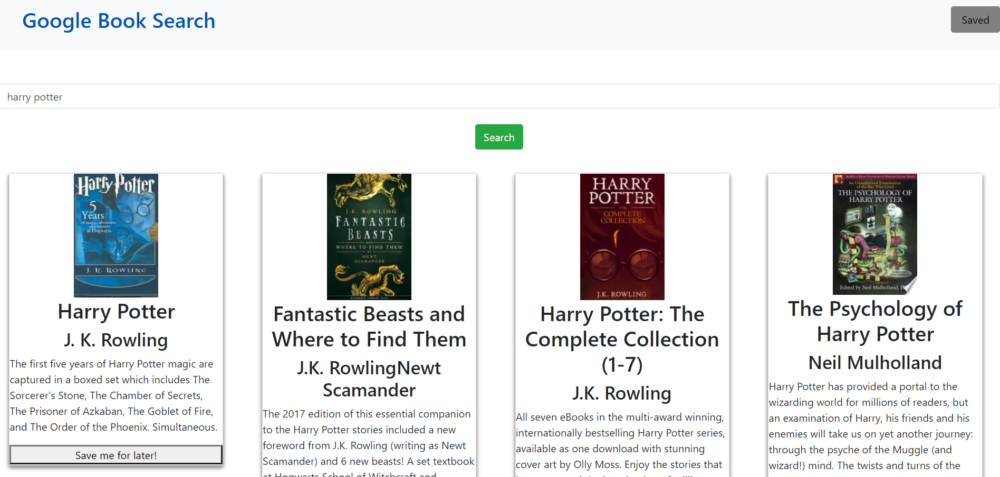

# google-book-search-ECB

# Unit 21 Mern Homework: google Book Search

In this activity, you'll create a new React-based Google Books Search app. This assignment requires you to create React components, work with helper/util functions, and utilize React lifecycle methods to query and display books based on user searches. You'll also use Node, Express and MongoDB so that users can save books to review or purchase later.

This activity was helped by some youtube videos by Jason Rivera and the link to those videos can be found here https://www.youtube.com/channel/UC35GZ6Q2QVEnV5IChbsThow and the series is called Build a Reactjs app with the Google Books API

The saved page of this project is not working and is currently pseudocoded.

## Table of Contents

1. [Link](#link)
2. [Description](#description)
3. [Use](#use)
4. [Installation](#installation)
5. [Contributing](#contributing)
6. [Questions](#questions)
7. [Example](#example)

### Link

The link to the heroku app for this repo is:

```
https://google-reading-search.herokuapp.com/
```

### Description

The application will be invoked with the following command:

```sh
npm run start
```

The user will be told what port the app is being served on and can go to localhost: in the web browser.

### Use

As a user, I want to be able to view books that I have searched or saved.

### Installation

Please run npm install to handle dependencies.

### Contributing

Contributions to this project are welcome.

### Questions

If you have an questions about the repo, open an issue or contact Elly Burgess directly at Eleanor.C.Burgess@gmail.com.

### Example


